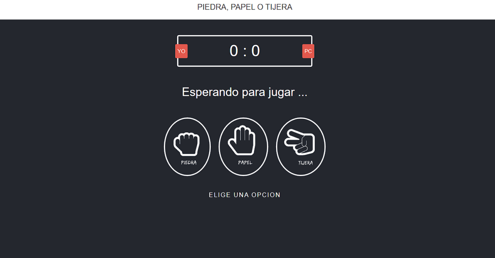

# Piedra 🗿, Papel 📄 o Tijera ✂️

Juego clasico realizado mediante ```HTML, CSS, JS```.

Este juego te permite elegir entre tres opciones: piedra, papel o tijera. 

Utilizando JavaScript, la máquina seleccionará aleatoriamente una de las tres opciones. 

Si no hay un empate, se otorgará un punto al jugador que logre ganar la ronda. 


